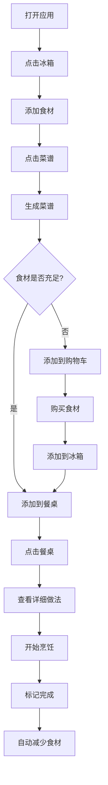
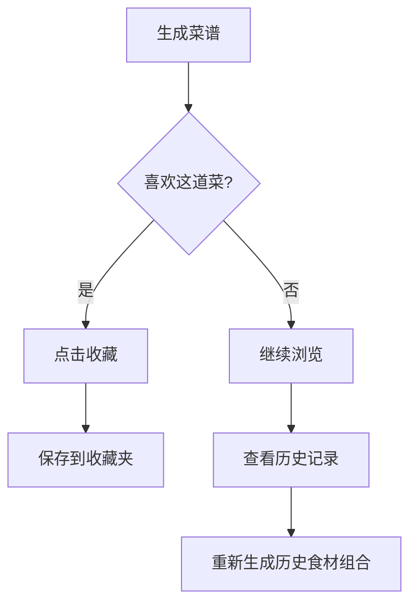

# AI 食谱生成器 - 前端页面设计文档

## 一、整体设计概述

### 1.1 设计理念

**核心理念:** 将厨房场景数字化,打造沉浸式的烹饪助手体验

**设计目标:**

- 🎨 **视觉化交互:** 用厨房元素(冰箱、餐桌、菜谱、购物车)替代传统导航,降低学习成本
- 🎯 **任务导向:** 围绕"食材管理 → 菜谱生成 → 烹饪执行"的核心流程设计
- 📱 **响应式设计:** 移动端优先,适配手机、平板、桌面端
- 🌙 **深色模式:** 支持浅色/深色主题切换,提升夜间使用体验

### 1.2 视觉风格

**主题:** 温馨厨房风格

- **背景:** 厨房场景插画(木质台面、瓷砖墙面、厨具装饰)
- **色调:**
  - 浅色模式: 暖色调(米黄#FFF8E7、浅木色#D4A574、白色#FFFFFF)
  - 深色模式: 深灰#1F2937、深蓝#1E3A5F、暖橙#F59E0B点缀
- **图标:** 扁平化设计,冰箱、餐桌、菜谱、购物车采用拟物化贴图

### 1.3 ��术栈

**前端框架:**

- Vue 3.5+ (Composition API)
- TypeScript 5.9+
- Vite 7+ (构建工具)

**UI框架:**

- Tailwind CSS 4+ (样式)
- Headless UI (无样式组件)

**状态管理:**

- Pinia (全局状态)

**工具库:**

- VueUse (组合式工具)
- Axios (HTTP请求)
- Day.js (时间处理)

---

## 二、页面架构设计

### 2.1 主界面布局

```
┌─────────────────────────────────────────────┐
│          [深色模式切换]  [用户头像]           │  ← 顶部栏
├─────────────────────────────────────────────┤
│                                             │
│          🏠 厨房背景场景                     │
│                                             │
│   [冰箱]  [餐桌]  [菜谱]  [购物车]           │  ← 导航元素
│                                             │
│                                             │
└─────────────────────────────────────────────┘
```

**布局说明:**

- **顶部栏:** 固定定位,包含主题切换、用户信息
- **主场景:** 厨房背景图,占据主要视口
- **导航元素:** 绝对定位在厨房场景中,模拟真实厨房布局
  - 冰箱: 左侧 (left: 10%, top: 30%)
  - 餐桌: 中央 (left: 40%, top: 50%)
  - 菜谱: 右上方 (right: 15%, top: 20%)
  - 购物车: 右下角 (right: 10%, bottom: 15%)

### 2.2 导航系统设计

**交互方式:** 点击式导航 + 遮罩层

**导航元素状态:**

- **默认状态:** 半透明贴图,鼠标悬停时高亮
- **激活状态:** 打开遮罩层,背景变暗(rgba(0,0,0,0.7))
- **关闭方式:** 点击遮罩层外部区域 / 点击关闭按钮

**遮罩层规范:**

- 尺寸: 移动端全屏,桌面端80%宽度居中
- 动画: 从下向上滑入(移动端) / 淡入+缩放(桌面端)
- 背景: 白色(浅色模式) / 深灰#1F2937(深色模式)
- 圆角: 16px(顶部)
- 阴影: 0 -4px 20px rgba(0,0,0,0.15)

### 2.3 响应式设计策略

**断点设置:**

- 移动端: < 768px
- 平板端: 768px - 1024px
- 桌面端: > 1024px

**适配方案:**

| 设备类型 | 导航元素布局 | 遮罩层样式 | 字体大小 |
|---------|------------|-----------|---------|
| 移动端 | 底部固定导航栏 | 全屏 | 14px |
| 平板端 | 厨房场景布局 | 90%宽度 | 16px |
| 桌面端 | 厨房场景布局 | 80%宽度 | 16px |

---

## 三、核心页面设计

### 3.1 主页面(厨房背景)

**组件:** `HomeView.vue`

**布局结构:**

```vue
<template>
  <div class="home-container">
    <!-- 顶部栏 -->
    <TopBar />

    <!-- 厨房背景 -->
    <div class="kitchen-scene">
      

      <!-- 导航元素 -->
      <NavigationItem
        v-for="item in navItems"
        :key="item.id"
        :item="item"
        @click="openModal(item.id)"
      />
    </div>

    <!-- 遮罩层容器 -->
    <ModalContainer v-model:visible="modalVisible" :type="currentModal" />
  </div>
</template>
```

**状态管理:**

```typescript
// stores/navigation.ts
export const useNavigationStore = defineStore('navigation', () => {
  const currentModal = ref<'fridge' | 'table' | 'recipe' | 'cart' | null>(null)
  const modalVisible = ref(false)

  const openModal = (type: string) => {
    currentModal.value = type
    modalVisible.value = true
  }

  const closeModal = () => {
    modalVisible.value = false
    setTimeout(() => currentModal.value = null, 300) // 等待动画结束
  }

  return { currentModal, modalVisible, openModal, closeModal }
})
```

### 3.2 冰箱页面(食材管理)

**组件:** `FridgeModal.vue`

**功能模块:**

1. 食材列表展示
2. 搜索食材
3. 增删改食材

**页面布局:**

```
┌─────────────────────────────────────┐
│  [X]  冰箱食材管理                   │  ← 标题栏
├─────────────────────────────────────┤
│  [🔍 搜索食材...]                    │  ← 搜索框
├─────────────────────────────────────┤
│  ┌─────────────────────────────┐   │
│  │ 🥬 白菜        数量: 1颗    │   │  ← 食材列表
│  │ 🥚 鸡蛋        数量: 6个    │   │
│  │ 🍅 番茄        数量: 3个    │   │
│  └─────────────────────────────┘   │
├─────────────────────────────────────┤
│  [➕ 添加] [🗑️ 删除] [✏️ 修改]      │  ← 操作按钮
└─────────────────────────────────────┘
```

**UI状态:**

- **默认状态:** 显示食材列表,操作按钮为默认样式
- **添加状态:** 弹出输入框(食材名称 + 数量)
- **删除状态:** 食材项显示删除图标,点击确认删除
- **修改状态:** 食材项变为可编辑状态,显示保存/取消按钮

**数据结构:**

```typescript
interface Ingredient {
  id: string
  name: string
  quantity: number
  unit: string
  category: '蔬菜' | '肉类' | '海鲜' | '主食' | '调味料'
  addedAt: Date
}
```

**状态管理:**

```typescript
// stores/ingredients.ts
export const useIngredientsStore = defineStore('ingredients', () => {
  const ingredients = ref<Ingredient[]>([])
  const searchQuery = ref('')
  const editMode = ref<'none' | 'add' | 'delete' | 'edit'>('none')

  const filteredIngredients = computed(() => {
    if (!searchQuery.value) return ingredients.value
    return ingredients.value.filter(item =>
      item.name.includes(searchQuery.value)
    )
  })

  const addIngredient = (ingredient: Omit<Ingredient, 'id' | 'addedAt'>) => {
    ingredients.value.push({
      ...ingredient,
      id: generateId(),
      addedAt: new Date()
    })
  }

  const deleteIngredient = (id: string) => {
    const index = ingredients.value.findIndex(item => item.id === id)
    if (index > -1) ingredients.value.splice(index, 1)
  }

  const updateIngredient = (id: string, updates: Partial<Ingredient>) => {
    const item = ingredients.value.find(i => i.id === id)
    if (item) Object.assign(item, updates)
  }

  return {
    ingredients,
    searchQuery,
    editMode,
    filteredIngredients,
    addIngredient,
    deleteIngredient,
    updateIngredient
  }
})
```

### 3.3 餐桌页面(当前决定做的菜)

**组件:** `TableModal.vue`

**功能模块:**

1. 显示当前决定做的菜品列表
2. 查看菜品详细做法
3. 删除菜品
4. 标记完成(清空列表并减少食材)

**页面布局:**

```
┌─────────────────────────────────────┐
│  [X]  今天做什么                     │  ← 标题栏
├─────────────────────────────────────┤
│  ┌─────────────────────────────┐   │
│  │ 🍜 番茄炒蛋      [查看][删除]│   │  ← 菜品列表
│  │ 🥘 宫保鸡丁      [查看][删除]│   │
│  │ 🍲 酸辣汤        [查看][删除]│   │
│  └─────────────────────────────┘   │
├─────────────────────────────────────┤
│  [✅ 已完成,开始做饭]                │  ← 完成按钮
└─────────────────────────────────────┘
```

**菜品详情页:**

```
┌─────────────────────────────────────┐
│  [←]  番茄炒蛋                       │  ← 返回按钮
├─────────────────────────────────────┤
│  📷 [菜品图片]                       │
├─────────────────────────────────────┤
│  📝 所需食材:                        │
│  ✅ 番茄 3个 (已有)                  │
│  ✅ 鸡蛋 2个 (已有)                  │
│  ❌ 葱 1根 (需购买)                  │
├─────────────────────────────────────┤
│  👨‍🍳 烹饪步骤:                        │
│  1. 番茄切块,鸡蛋打散                │
│  2. 热锅倒油,炒鸡蛋至凝固            │
│  3. 加入番茄翻炒                     │
│  ...                                │
├─────────────────────────────────────┤
│  ⏱️ 烹饪时间: 15分钟                 │
│  📊 难度: 简单                       │
├─────────────────────────────────────┤
│  [📤 导出为图片] [📄 导出为文本]     │  ← 导出按钮
└─────────────────────────────────────┘
```

**数据结构:**

```typescript
interface Recipe {
  id: string
  name: string
  cuisine: string
  imageUrl?: string
  ingredients: {
    available: Array<{ name: string; quantity: number; unit: string }>
    needed: Array<{ name: string; quantity: number; unit: string }>
  }
  steps: string[]
  cookingTime: number // 分钟
  difficulty: '简单' | '中等' | '复杂'
  createdAt: Date
}
```

**状态管理:**

```typescript
// stores/currentRecipes.ts
export const useCurrentRecipesStore = defineStore('currentRecipes', () => {
  const recipes = ref<Recipe[]>([])

  const addRecipe = (recipe: Recipe) => {
    if (!recipes.value.find(r => r.id === recipe.id)) {
      recipes.value.push(recipe)
    }
  }

  const removeRecipe = (id: string) => {
    const index = recipes.value.findIndex(r => r.id === id)
    if (index > -1) recipes.value.splice(index, 1)
  }

  const completeRecipes = () => {
    // 减少食材数量
    const ingredientsStore = useIngredientsStore()
    recipes.value.forEach(recipe => {
      recipe.ingredients.available.forEach(ing => {
        ingredientsStore.decreaseQuantity(ing.name, ing.quantity)
      })
    })
    // 清空列表
    recipes.value = []
  }

  return { recipes, addRecipe, removeRecipe, completeRecipes }
})
```

### 3.4 菜谱页面(生成/收藏/历史)

**组件:** `RecipeModal.vue`

**功能模块:**

1. 生成菜谱
2. 我的收藏
3. 历史生成记录
4. 当前决定做的菜

**页面布局:**

```
┌─────────────────────────────────────┐
│  [X]  菜谱中心                       │  ← 标题栏
├─────────────────────────────────────┤
│  [生成] [收藏] [历史] [当前]        │  ← Tab导航
├─────────────────────────────────────┤
│  📋 Tab内容区域                      │
│                                     │
│  (根据选中的Tab显示不同内容)        │
│                                     │
└─────────────────────────────────────┘
```

#### 3.4.1 生成菜谱Tab

**布局:**

```
┌─────────────────────────────────────┐
│  🎯 根据冰箱食材生成菜谱             │
├─────────────────────────────────────┤
│  当前食材: 白菜、鸡蛋、番茄 (+3)     │  ← 食材预览
├─────────────────────────────────────┤
│  筛选条件:                           │
│  [中餐▼] [15分钟▼] [简单▼]          │  ← 筛选器
├─────────────────────────────────────┤
│  [🎲 生成菜谱]                       │  ← 生成按钮
├─────────────────────────────────────┤
│  生成结果: (3道菜谱)                 │
│  ┌─────────────────────────────┐   │
│  │ 🍜 番茄炒蛋                  │   │  ← 菜谱卡片
│  │ ⏱️ 15分钟 | 📊 简单          │   │
│  │ ✅ 已有食材: 番茄、鸡蛋      │   │
│  │ ❌ 需购买: 葱、盐            │   │
│  │ [➕ 添加到餐桌] [⭐ 收藏]    │   │
│  └─────────────────────────────┘   │
└─────────────────────────────────────┘
```

**交互流程:**

1. 点击"生成菜谱"按钮
2. 显示加载动画(骨架屏)
3. 调用后端API生成3-5道菜谱
4. 显示菜谱卡片列表
5. 用户可以:
   - 点击卡片查看详情
   - 添加到餐桌(当前决定做的菜)
   - 收藏菜谱
   - 检查食材是否充足

**食材不足提示:**

```typescript
// 检查食材是否充足
const checkIngredients = (recipe: Recipe) => {
  const ingredientsStore = useIngredientsStore()
  const missingIngredients = recipe.ingredients.needed.filter(ing => {
    const fridgeItem = ingredientsStore.findByName(ing.name)
    return !fridgeItem || fridgeItem.quantity < ing.quantity
  })

  if (missingIngredients.length > 0) {
    // 显示提示: "缺少食材: 葱、盐,是否添加到购物车?"
    return {
      sufficient: false,
      missing: missingIngredients
    }
  }
  return { sufficient: true, missing: [] }
}
```

#### 3.4.2 我的收藏Tab

**布局:**

```
┌─────────────────────────────────────┐
│  ⭐ 我的收藏 (12道菜)                │
├─────────────────────────────────────┤
│  [全部] [中餐] [西餐] [日韩]        │  ← 分类筛选
├─────────────────────────────────────┤
│  ┌─────────────────────────────┐   │
│  │ 🍜 番茄炒蛋                  │   │  ← 收藏的菜谱
│  │ 收藏于: 2024-01-15          │   │
│  │ [查看] [取消收藏]            │   │
│  └─────────────────────────────┘   │
└─────────────────────────────────────┘
```

**数据持久化:**

```typescript
// stores/favorites.ts
export const useFavoritesStore = defineStore('favorites', () => {
  const favorites = ref<Recipe[]>([])

  // 从LocalStorage加载
  const loadFavorites = () => {
    const saved = localStorage.getItem('favorites')
    if (saved) favorites.value = JSON.parse(saved)
  }

  // 保存到LocalStorage
  const saveFavorites = () => {
    localStorage.setItem('favorites', JSON.stringify(favorites.value))
  }

  const addFavorite = (recipe: Recipe) => {
    if (!favorites.value.find(r => r.id === recipe.id)) {
      favorites.value.push(recipe)
      saveFavorites()
    }
  }

  const removeFavorite = (id: string) => {
    const index = favorites.value.findIndex(r => r.id === id)
    if (index > -1) {
      favorites.value.splice(index, 1)
      saveFavorites()
    }
  }

  return { favorites, loadFavorites, addFavorite, removeFavorite }
})
```

#### 3.4.3 历史记录Tab

**布局:**

```
┌─────────────────────────────────────┐
│  📜 历史生成记录 (最近10次)          │
├─────────────────────────────────────┤
│  ┌──────────────────────────────┐   │
│  │ 2024-01-15 14:30             │   │  ← 历史记录项
│  │ 食材: 白菜、鸡蛋、番茄         │   │
│  │ 生成了3道菜                   │   │
│  │ [查看]                        │   │
│  └──���───────────────────────┘   │
└─────────────────────────────────────┘
```

### 3.5 购物车页面(购买清单)

**组件:** `CartModal.vue`

**功能模块:**

1. 显示需要购买的食材列表
2. 修改食材数量
3. 增删食材
4. 标记已购买(自动添加到冰箱)

**页面布局:**

```
┌─────────────────────────────────────┐
│  [X]  购物清单                       │  ← 标题栏
├─────────────────────────────────────┤
│  📝 需要购买的食材:                  │
├─────────────────────────────────────┤
│  ┌─────────────────────────────┐   │
│  │ 🧅 葱          1根  [+][-]  │   │  ← 食材项
│  │ 🧂 盐          1袋  [+][-]  │   │
│  │ 🛢️ 油          1瓶  [+][-]  │   │
│  └─────────────────────────────┘   │
├─────────────────────────────────────┤
│  [➕ 添加食材]                       │  ← 添加按钮
├─────────────────────────────────────┤
│  [✅ 已购买,添加到冰箱]              │  ← 完成按钮
└─────────────────────────────────────┘
```

**数据结构:**

```typescript
interface CartItem {
  id: string
  name: string
  quantity: number
  unit: string
  category: string
  addedAt: Date
  fromRecipe?: string // 来自哪道菜谱
}
```

**状态管理:**

```typescript
// stores/cart.ts
export const useCartStore = defineStore('cart', () => {
  const items = ref<CartItem[]>([])

  const addItem = (item: Omit<CartItem, 'id' | 'addedAt'>) => {
    const existing = items.value.find(i => i.name === item.name)
    if (existing) {
      existing.quantity += item.quantity
    } else {
      items.value.push({
        ...item,
        id: generateId(),
        addedAt: new Date()
      })
    }
  }

  const updateQuantity = (id: string, quantity: number) => {
    const item = items.value.find(i => i.id === id)
    if (item) item.quantity = quantity
  }

  const removeItem = (id: string) => {
    const index = items.value.findIndex(i => i.id === id)
    if (index > -1) items.value.splice(index, 1)
  }

  const completePurchase = () => {
    // 将购物车食材添加到冰箱
    const ingredientsStore = useIngredientsStore()
    items.value.forEach(item => {
      ingredientsStore.addIngredient({
        name: item.name,
        quantity: item.quantity,
        unit: item.unit,
        category: item.category as any
      })
    })
    // 清空购物车
    items.value = []
  }

  return { items, addItem, updateQuantity, removeItem, completePurchase }
})
```

---

## 四、组件设计

### 4.1 通用组件

#### 4.1.1 遮罩层组件 (ModalContainer.vue)

**功能:** 统一管理所有遮罩层的显示和动画

**Props:**

```typescript
interface Props {
  visible: boolean
  type: 'fridge' | 'table' | 'recipe' | 'cart' | null
}
```

**实现:**

```vue
<template>
  <Transition name="modal">
    <div v-if="visible" class="modal-overlay" @click.self="close">
      <div class="modal-content">
        <component :is="currentComponent" @close="close" />
      </div>
    </div>
  </Transition>
</template>

<script setup lang="ts">
import { computed } from 'vue'
import FridgeModal from './FridgeModal.vue'
import TableModal from './TableModal.vue'
import RecipeModal from './RecipeModal.vue'
import CartModal from './CartModal.vue'

const props = defineProps<Props>()
const emit = defineEmits<{ close: [] }>()

const currentComponent = computed(() => {
  const components = {
    fridge: FridgeModal,
    table: TableModal,
    recipe: RecipeModal,
    cart: CartModal
  }
  return props.type ? components[props.type] : null
})

const close = () => emit('close')
</script>

<style scoped>
.modal-overlay {
  position: fixed;
  inset: 0;
  background: rgba(0, 0, 0, 0.7);
  display: flex;
  align-items: center;
  justify-content: center;
  z-index: 1000;
}

.modal-content {
  background: white;
  border-radius: 16px;
  max-width: 90%;
  max-height: 90%;
  overflow: auto;
}

/* 动画 */
.modal-enter-active,
.modal-leave-active {
  transition: opacity 0.3s ease;
}

.modal-enter-from,
.modal-leave-to {
  opacity: 0;
}

.modal-enter-active .modal-content {
  animation: slideUp 0.3s ease;
}

@keyframes slideUp {
  from {
    transform: translateY(100px);
    opacity: 0;
  }
  to {
    transform: translateY(0);
    opacity: 1;
  }
}
</style>
```

#### 4.1.2 菜谱卡片组件 (RecipeCard.vue)

**功能:** 展示单个菜谱的信息

**Props:**

```typescript
interface Props {
  recipe: Recipe
  showActions?: boolean
}
```

**实现:**

```vue
<template>
  <div class="recipe-card">
    <!-- 菜谱图片 -->
    <div class="recipe-image">
      
    </div>

    <!-- 菜谱信息 -->
    <div class="recipe-info">
      <h3 class="recipe-name">{{ recipe.name }}</h3>

      <div class="recipe-meta">
        <span>⏱️ {{ recipe.cookingTime }}分钟</span>
        <span>📊 {{ recipe.difficulty }}</span>
        <span>🍽️ {{ recipe.cuisine }}</span>
      </div>

      <!-- 食材状态 -->
      <div class="ingredients-status">
        <div class="available">
          ✅ 已有: {{ recipe.ingredients.available.map(i => i.name).join('、') }}
        </div>
        <div v-if="recipe.ingredients.needed.length > 0" class="needed">
          ❌ 需购买: {{ recipe.ingredients.needed.map(i => i.name).join('、') }}
        </div>
      </div>

      <!-- 操作按钮 -->
      <div v-if="showActions" class="recipe-actions">
        <button @click="$emit('add-to-table')">➕ 添加到餐桌</button>
        <button @click="$emit('favorite')">⭐ 收藏</button>
        <button @click="$emit('view-detail')">👁️ 查看详情</button>
      </div>
    </div>
  </div>
</template>

<script setup lang="ts">
import { computed } from 'vue'
import type { Recipe } from '@/types'

const props = defineProps<Props>()
const emit = defineEmits<{
  'add-to-table': []
  'favorite': []
  'view-detail': []
}>()

const defaultImage = '/images/recipe-placeholder.png'
</script>
```

#### 4.1.3 加载骨架屏 (RecipeSkeleton.vue)

**功能:** 在加载菜谱时显示占位符

**实现:**

```vue
<template>
  <div class="skeleton-card">
    <div class="skeleton-image"></div>
    <div class="skeleton-content">
      <div class="skeleton-title"></div>
      <div class="skeleton-meta"></div>
      <div class="skeleton-text"></div>
      <div class="skeleton-text"></div>
    </div>
  </div>
</template>

<style scoped>
.skeleton-card {
  animation: pulse 1.5s ease-in-out infinite;
}

@keyframes pulse {
  0%, 100% { opacity: 1; }
  50% { opacity: 0.5; }
}

.skeleton-image,
.skeleton-title,
.skeleton-meta,
.skeleton-text {
  background: linear-gradient(90deg, #f0f0f0 25%, #e0e0e0 50%, #f0f0f0 75%);
  background-size: 200% 100%;
  animation: shimmer 1.5s infinite;
}

@keyframes shimmer {
  0% { background-position: -200% 0; }
  100% { background-position: 200% 0; }
}
</style>
```

### 4.2 筛选栏组件 (FilterBar.vue)

**功能:** 提供菜系、时间、难度等筛选选项

**Props:**

```typescript
interface Props {
  modelValue: FilterOptions
}

interface FilterOptions {
  cuisine?: string
  cookingTime?: number
  difficulty?: string
}
```

**实现:**

```vue
<template>
  <div class="filter-bar">
    <select v-model="filters.cuisine" @change="emitChange">
      <option value="">全部菜系</option>
      <option value="中餐">中餐</option>
      <option value="西餐">西餐</option>
      <option value="日韩">日韩</option>
      <option value="东南亚">东南亚</option>
    </select>

    <select v-model="filters.cookingTime" @change="emitChange">
      <option value="">不限时间</option>
      <option :value="15">15分钟以内</option>
      <option :value="30">30分钟以内</option>
      <option :value="60">1小时以内</option>
    </select>

    <select v-model="filters.difficulty" @change="emitChange">
      <option value="">不限难度</option>
      <option value="简单">简单</option>
      <option value="中等">中等</option>
      <option value="复杂">复杂</option>
    </select>
  </div>
</template>

<script setup lang="ts">
import { reactive } from 'vue'

const props = defineProps<Props>()
const emit = defineEmits<{ 'update:modelValue': [FilterOptions] }>()

const filters = reactive({ ...props.modelValue })

const emitChange = () => {
  emit('update:modelValue', { ...filters })
}
</script>
```

---

## 五、交互流程设计

### 5.1 核心用户流程

#### 流程1: 食材管理 → 菜谱生成 → 烹饪执行



#### 流程2: 收藏与历史



### 5.2 状态管理架构

**全局状态:**

```typescript
// stores/index.ts
export const useAppStore = defineStore('app', () => {
  // 主题
  const theme = ref<'light' | 'dark'>('light')

  // 当前打开的模态框
  const currentModal = ref<string | null>(null)

  // 加载状态
  const loading = ref(false)

  // Toast通知
  const toast = reactive({
    visible: false,
    message: '',
    type: 'info' as 'info' | 'success' | 'error' | 'warning'
  })

  const showToast = (message: string, type = 'info') => {
    toast.message = message
    toast.type = type
    toast.visible = true
    setTimeout(() => toast.visible = false, 3000)
  }

  return { theme, currentModal, loading, toast, showToast }
})
```

**状态持久化:**

```typescript
// plugins/persistence.ts
import { watch } from 'vue'
import { useIngredientsStore } from '@/stores/ingredients'
import { useFavoritesStore } from '@/stores/favorites'
import { useCartStore } from '@/stores/cart'

export const setupPersistence = () => {
  const ingredientsStore = useIngredientsStore()
  const favoritesStore = useFavoritesStore()
  const cartStore = useCartStore()

  // 监听状态变化并保存到LocalStorage
  watch(
    () => ingredientsStore.ingredients,
    (value) => localStorage.setItem('ingredients', JSON.stringify(value)),
    { deep: true }
  )

  watch(
    () => favoritesStore.favorites,
    (value) => localStorage.setItem('favorites', JSON.stringify(value)),
    { deep: true }
  )

  watch(
    () => cartStore.items,
    (value) => localStorage.setItem('cart', JSON.stringify(value)),
    { deep: true }
  )

  // 应用启动时加载数据
  const loadData = () => {
    const ingredients = localStorage.getItem('ingredients')
    if (ingredients) ingredientsStore.ingredients = JSON.parse(ingredients)

    const favorites = localStorage.getItem('favorites')
    if (favorites) favoritesStore.favorites = JSON.parse(favorites)

    const cart = localStorage.getItem('cart')
    if (cart) cartStore.items = JSON.parse(cart)
  }

  loadData()
}
```

### 5.3 页面跳转逻辑

**路由配置:**

```typescript
// router/index.ts
import { createRouter, createWebHistory } from 'vue-router'
import HomeView from '@/views/HomeView.vue'

const router = createRouter({
  history: createWebHistory(),
  routes: [
    {
      path: '/',
      name: 'home',
      component: HomeView
    },
    {
      path: '/recipe/:id',
      name: 'recipe-detail',
      component: () => import('@/views/RecipeDetailView.vue')
    }
  ]
})

export default router
```

**导航守卫:**

```typescript
router.beforeEach((to, from, next) => {
  // 关闭所有模态框
  const navigationStore = useNavigationStore()
  navigationStore.closeModal()

  next()
})
```

---

## 六、功能模块详细设计

### 6.1 食材管理模块

**核心功能:**

1. 添加食材(手动输入 + 快速选择)
2. 搜索食材
3. 修改食材数量
4. 删除食材
5. 食材分类展示

**快速选择实现:**

```typescript
// 常用食材数据
const commonIngredients = {
  蔬菜: ['白菜', '番茄', '黄瓜', '土豆', '胡萝卜', '青椒'],
  肉类: ['猪肉', '鸡肉', '牛肉', '羊肉'],
  海鲜: ['虾', '鱼', '蟹', '贝类'],
  主食: ['米饭', '面条', '馒头', '面包'],
  调味料: ['盐', '油', '酱油', '醋', '糖']
}

// 快速添加组件
const QuickAddIngredients = () => {
  const ingredientsStore = useIngredientsStore()

  const addQuick = (name: string, category: string) => {
    ingredientsStore.addIngredient({
      name,
      quantity: 1,
      unit: '份',
      category: category as any
    })
  }

  return { commonIngredients, addQuick }
}
```

### 6.2 菜谱生成模块

**AI Prompt设计:**

```typescript
const generateRecipePrompt = (ingredients: string[], filters: FilterOptions) => {
  return `你是一个专业的厨师助手。用户提供了以下食材：${ingredients.join('、')}

请生成 3 道创意菜谱,要求：
1. 菜品必须可行且美味
2. 尽量使用用户提供的食材
3. 缺少的食材要常见且易购买
4. 步骤详细但不冗长
${filters.cuisine ? `5. 菜系限定为：${filters.cuisine}` : ''}
${filters.cookingTime ? `6. 烹饪时间不超过：${filters.cookingTime}分钟` : ''}
${filters.difficulty ? `7. 难度等级：${filters.difficulty}` : ''}

请严格按照以下 JSON 格式返回（不要添加任何其他文本）：
{
  "recipes": [
    {
      "name": "菜品名称",
      "cuisine": "中餐",
      "ingredients": {
        "available": ["番茄", "鸡蛋"],
        "needed": ["葱", "盐", "油"]
      },
      "steps": [
        "1. 番茄切块，鸡蛋打散",
        "2. 热锅倒油，炒鸡蛋至凝固",
        "3. 加入番茄翻炒"
      ],
      "cookingTime": 15,
      "difficulty": "简单"
    }
  ]
}`
}
```

**API调用:**

```typescript
// services/ai.ts
import axios from 'axios'

export const generateRecipes = async (
  ingredients: string[],
  filters: FilterOptions = {}
): Promise<Recipe[]> => {
  try {
    const response = await axios.post('/api/recipes/generate', {
      ingredients,
      filters
    })

    return response.data.data.recipes
  } catch (error) {
    console.error('生成菜谱失败:', error)
    throw new Error('生成菜谱失败,请稍后重试')
  }
}
```

### 6.3 收藏与历史模块

**收藏功能:**

- 使用LocalStorage持久化
- 支持按菜系分类
- 支持搜索收藏的菜谱

**历史记录:**

- 保存最近10次生成记录
- 记录食材组合和生成时间
- 支持重新生成

**实现:**

```typescript
// stores/history.ts
export const useHistoryStore = defineStore('history', () => {
  const history = ref<HistoryRecord[]>([])
  const maxRecords = 10

  interface HistoryRecord {
    id: string
    ingredients: string[]
    filters: FilterOptions
    recipes: Recipe[]
    createdAt: Date
  }

  const addRecord = (record: Omit<HistoryRecord, 'id' | 'createdAt'>) => {
    history.value.unshift({
      ...record,
      id: generateId(),
      createdAt: new Date()
    })

    // 保持最多10条记录
    if (history.value.length > maxRecords) {
      history.value = history.value.slice(0, maxRecords)
    }

    saveToStorage()
  }

  const saveToStorage = () => {
    localStorage.setItem('history', JSON.stringify(history.value))
  }

  const loadFromStorage = () => {
    const saved = localStorage.getItem('history')
    if (saved) history.value = JSON.parse(saved)
  }

  return { history, addRecord, loadFromStorage }
})
```

### 6.4 购物清单模块

**自动生成购物清单:**

```typescript
const generateShoppingList = (recipes: Recipe[]) => {
  const cartStore = useCartStore()
  const ingredientsStore = useIngredientsStore()

  recipes.forEach(recipe => {
    recipe.ingredients.needed.forEach(ing => {
      // 检查冰箱是否已有
      const fridgeItem = ingredientsStore.findByName(ing.name)
      if (!fridgeItem || fridgeItem.quantity < ing.quantity) {
        const needed = ing.quantity - (fridgeItem?.quantity || 0)
        cartStore.addItem({
          name: ing.name,
          quantity: needed,
          unit: ing.unit,
          category: '待分类',
          fromRecipe: recipe.name
        })
      }
    })
  })
}
```

**按超市区域分类:**

```typescript
const categorizeBySection = (items: CartItem[]) => {
  const sections = {
    蔬菜区: [] as CartItem[],
    肉类区: [] as CartItem[],
    海鲜区: [] as CartItem[],
    主食区: [] as CartItem[],
    调味品区: [] as CartItem[]
  }

  items.forEach(item => {
    const section = getSectionByCategory(item.category)
    sections[section].push(item)
  })

  return sections
}
```

---

## 七、技术实现要点

### 7.1 深色模式实现

**Tailwind配置:**

```typescript
// tailwind.config.ts
export default {
  darkMode: 'class',
  theme: {
    extend: {
      colors: {
        primary: {
          light: '#F59E0B',
          dark: '#D97706'
        },
        background: {
          light: '#FFF8E7',
          dark: '#1F2937'
        }
      }
    }
  }
}
```

**主题切换:**

```typescript
// stores/theme.ts
export const useThemeStore = defineStore('theme', () => {
  const isDark = ref(false)

  // 从LocalStorage加载
  const loadTheme = () => {
    const saved = localStorage.getItem('theme')
    if (saved) {
      isDark.value = saved === 'dark'
    } else {
      // 检测系统主题
      isDark.value = window.matchMedia('(prefers-color-scheme: dark)').matches
    }
    applyTheme()
  }

  // 应用主题
  const applyTheme = () => {
    if (isDark.value) {
      document.documentElement.classList.add('dark')
    } else {
      document.documentElement.classList.remove('dark')
    }
  }

  // 切换主题
  const toggleTheme = () => {
    isDark.value = !isDark.value
    localStorage.setItem('theme', isDark.value ? 'dark' : 'light')
    applyTheme()
  }

  return { isDark, loadTheme, toggleTheme }
})
```

### 7.2 API集成

**Axios配置:**

```typescript
// services/api.ts
import axios from 'axios'

const api = axios.create({
  baseURL: import.meta.env.VITE_API_BASE_URL || 'http://localhost:8080',
  timeout: 30000
})

// 请求拦截器
api.interceptors.request.use(
  (config) => {
    const appStore = useAppStore()
    appStore.loading = true
    return config
  },
  (error) => {
    return Promise.reject(error)
  }
)

// 响应拦截器
api.interceptors.response.use(
  (response) => {
    const appStore = useAppStore()
    appStore.loading = false
    return response
  },
  (error) => {
    const appStore = useAppStore()
    appStore.loading = false
    appStore.showToast(error.message || '请求失败', 'error')
    return Promise.reject(error)
  }
)

export default api
```

### 7.3 图片懒加载

**实现:**

```vue
<template>
  <div class="lazy-image">
    
    <div v-else class="placeholder">
      <div class="spinner"></div>
    </div>
  </div>
</template>

<script setup lang="ts">
import { ref, onMounted } from 'vue'

const props = defineProps<{
  src: string
  alt: string
}>()

const loaded = ref(false)
const observer = ref<IntersectionObserver | null>(null)

onMounted(() => {
  observer.value = new IntersectionObserver((entries) => {
    if (entries[0].isIntersecting) {
      loaded.value = true
      observer.value?.disconnect()
    }
  })

  observer.value.observe(document.querySelector('.lazy-image')!)
})

const onLoad = () => {
  // 图片加载成功
}

const onError = () => {
  // 图片加载失败,显示占位图
}
</script>
```

---

## 八、UI/UX细节

### 8.1 颜色方案

**浅色模式:**

- 主色: #F59E0B (暖橙)
- 背景: #FFF8E7 (米黄)
- 文字: #1F2937 (深灰)
- 边框: #E5E7EB (浅灰)

**深色模式:**

- 主色: #F59E0B (暖橙)
- 背景: #1F2937 (深灰)
- 文字: #F9FAFB (浅白)
- 边框: #374151 (中灰)

### 8.2 字体排版

**字体家族:**

```css
font-family: -apple-system, BlinkMacSystemFont, 'Segoe UI', 'PingFang SC',
  'Hiragino Sans GB', 'Microsoft YaHei', sans-serif;
```

**字号规范:**

- 标题: 24px / 20px / 18px
- 正文: 16px
- 辅助文字: 14px
- 小字: 12px

### 8.3 动画效果

**页面切换:**

```css
.page-enter-active,
.page-leave-active {
  transition: all 0.3s ease;
}

.page-enter-from {
  opacity: 0;
  transform: translateX(20px);
}

.page-leave-to {
  opacity: 0;
  transform: translateX(-20px);
}
```

**按钮交互:**

```css
.button {
  transition: all 0.2s ease;
}

.button:hover {
  transform: translateY(-2px);
  box-shadow: 0 4px 12px rgba(0, 0, 0, 0.15);
}

.button:active {
  transform: translateY(0);
}
```

### 8.4 加载状态

**全局加载:**

```vue
<template>
  <div v-if="loading" class="loading-overlay">
    <div class="spinner"></div>
    <p>正在生成菜谱...</p>
  </div>
</template>

<style scoped>
.loading-overlay {
  position: fixed;
  inset: 0;
  background: rgba(0, 0, 0, 0.5);
  display: flex;
  flex-direction: column;
  align-items: center;
  justify-content: center;
  z-index: 9999;
}

.spinner {
  width: 40px;
  height: 40px;
  border: 4px solid #f3f3f3;
  border-top: 4px solid #F59E0B;
  border-radius: 50%;
  animation: spin 1s linear infinite;
}

@keyframes spin {
  0% { transform: rotate(0deg); }
  100% { transform: rotate(360deg); }
}
</style>
```

---

## 九、开发优先级

### 阶段1: 核心MVP (2-3周)

**必须实现:**

1. ✅ 主界面(厨房背景 + 导航)
2. ✅ 冰箱页面(食材管理)
3. ✅ 菜谱生成功能
4. ✅ 餐桌页面(当前菜品)
5. ✅ 深色模式

### 阶段2: 功能增强 (1-2周)

**重要功能:**

1. ✅ 筛选与排序
2. ✅ 收藏功能
3. ✅ 历史记录
4. ✅ 购物车功能

### 阶段3: 进阶功能 (2-3周)

**可选功能:**

1. ⭐ 智能食材替代
2. ⭐ 营养分析
3. ⭐ 导出功能(图片/文本)
4. ⭐ 用户认证

---

## 十、总结

本文档详细设计了AI食谱生成器的前端页面,包括:

1. **整体设计:** 厨房主题的沉浸式界面,温馨友好的视觉风格
2. **页面架构:** 主界面 + 4个功能模态框(冰箱/餐桌/菜谱/购物车)
3. **核心功能:** 食材管理、AI菜谱生成、收藏历史、购物清单
4. **技术实现:** Vue 3 + TypeScript + Tailwind CSS,前后端分离架构
5. **交互设计:** 清晰的用户流程,完善的状态管理
6. **UI/UX:** 深色模式、响应式布局、流畅动画

该设计方案可以直接指导前端开发,实现一个功能完整、体验优秀的AI食谱生成应用。
